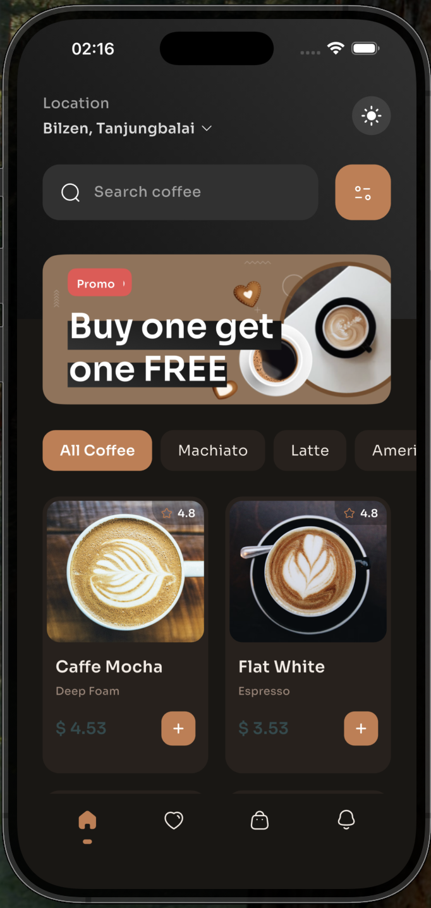

<p align="center">
  
</p>

<h1 align="center">☕ Just Caffe</h1>

<p align="center">
  <strong>A beautifully crafted Flutter UI Kit for Coffee Shop apps</strong>
</p>

<p align="center">
  
  
  
  
</p>

---

## ✨ Overview

**Just Caffe** is a premium, pixel-perfect Flutter UI kit designed for coffee shop and food delivery applications. It features a complete end-to-end user flow — from browsing a menu and viewing product details to placing orders, tracking deliveries on a real map, and managing favourites, cart, and notifications.

Built with clean architecture, smooth animations, and full **Dark Mode** support out of the box.

---

## 📱 Features

| Feature | Description |
|---|---|
| **Animated Onboarding** | Smooth slide and fade transitions to welcome new users |
| **Home Screen** | Category filters, coffee grid, promo banner, and search bar |
| **Product Detail** | Rich product info with size picker, ratings, and animated entry |
| **Order Flow** | Delivery/Pickup toggle, address section, payment summary, and discount banners |
| **Live Map Tracking** | Real OpenStreetMap integration via `flutter_map` with route polylines |
| **Favourites** | Reactive grid with tap-to-remove and staggered animations |
| **Cart** | Quantity counters, swipe-to-delete, dynamic total price calculation |
| **Notifications** | Categorised feed (Promos & Orders) with swipe-to-dismiss |
| **Dark Mode** | Full system-aware + manual toggle with seamless theme switching |

---

## 🏗️ Architecture

The project follows a clean, modular folder structure for scalability and maintainability:

```
lib/
├── main.dart                          # App entry point with Provider setup
└── src/
    ├── app.dart                       # MaterialApp with theme consumer
    ├── core/
    │   ├── constants/                 # Asset paths, app constants
    │   ├── extension/                 # BuildContext extensions (theme, colors)
    │   ├── navigation/                # Custom navigator & singleton
    │   ├── theme/                     # Light/Dark ThemeData, AppColors, AppTheme provider
    │   └── typography/                # App-wide text styles (Sora font family)
    ├── view/
    │   ├── screens/
    │   │   ├── splash_screen.dart     # Animated splash
    │   │   ├── onboarding_screen.dart # Onboarding carousel
    │   │   ├── home/                  # Home screen + widgets
    │   │   ├── detail/                # Product detail + widgets
    │   │   ├── order/                 # Order flow + widgets
    │   │   ├── track_order/           # Map tracking + widgets
    │   │   ├── cart/                  # Cart management + widgets
    │   │   ├── favourite/             # Favourites grid + widgets
    │   │   └── notifications/         # Notification feed + widgets
    │   └── widgets/                   # Shared widgets (BaseView, BottomBar)
    ├── shared/                        # Reusable UI components (AppButton, etc.)
    ├── model/                         # Data models
    └── data/                          # Data layer
```

---

## 🎨 Design System

### Theme
- **Semantic Color Extensions** on `BuildContext` for reactive dark mode
  - `context.primaryText` · `context.secondaryText` · `context.surfaceColor`
  - `context.backgroundColor` · `context.dividerColor` · `context.subSurfaceColor`
- Automatic system detection with manual override toggle

### Typography
- **Font Family**: [Sora](https://fonts.google.com/specimen/Sora) — a clean, modern geometric sans-serif
- Consistent text style hierarchy via `AppTextStyles`

### Colors
| Token | Light | Dark |
|---|---|---|
| Surface Primary | `#FFFFFF` | `#1A1714` |
| Surface Brand | `#C67C4E` | `#C67C4E` |
| Text High | `#313131` | `#F5EDE6` |
| Text Mid | `#E3E3E3` | `#9E8578` |
| Border | `#E5E5E5` | `#3A2F27` |

---

## 📦 Dependencies

| Package | Purpose |
|---|---|
| `flutter_screenutil` | Responsive sizing across screen densities |
| `flutter_animate` | Declarative staggered animations |
| `flutter_hooks` | Reactive local state with `useState` |
| `provider` | Global theme state management |
| `flutter_svg` | SVG asset rendering |
| `flutter_map` + `latlong2` | Real OpenStreetMap-based order tracking |
| `bounce` | Tap feedback animations |

---

## 🚀 Getting Started

### Prerequisites

- Flutter SDK `>= 3.10.3`
- Dart SDK `>= 3.x`
- iOS Simulator / Android Emulator or physical device

### Installation

```bash
# Clone the repository
git clone https://github.com/your-username/just_caffe.git
cd just_caffe

# Install dependencies
flutter pub get

# Run the app
flutter run
```

---

## 🌙 Dark Mode

Just Caffe ships with full dark mode support that works in two ways:

1. **Automatic** — Follows the device's system theme on first launch
2. **Manual Toggle** — Tap the sun/moon icon in the Home screen header to override

The theme engine uses a `ChangeNotifier` provider (`AppTheme`) consumed by `MaterialApp`, with semantic color extensions on `BuildContext` so every widget reacts instantly to theme changes.

---

## 📄 License

This project is licensed under the **MIT License** — see the [LICENSE](LICENSE) file for details.

---

<p align="center">
  Made with ❤️ and ☕ in Flutter
</p>
